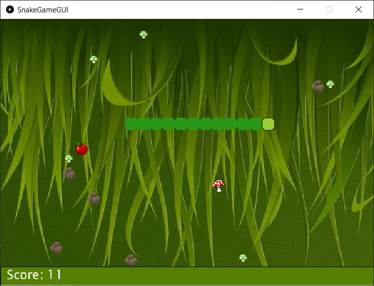

Autorin: Neha Kandhari

##### Inhaltsverzeichnis

- [Kurzbeschreibung](#kurzbeschreibung)
- [Screenshot zur Anwendung](#screenshot-zur-Anwendung)
- [Bedienungshinweise](#bedienungshinweise)
- [Zur Dateiübersicht](#datei%C3%BCbersicht)
    - [Zur Übersicht der Lines of Code LoC](#%C3%BCbersicht-der-lines-of-code-loc)
- [Quellenangaben](#quellen)

## Kurzbeschreibung 

Bei dem Spiel „Snake Game Deluxe“ handelt es sich um eine Variante des bekannten Klassikers „Snake“. 
Dabei müssen Pilze vermieden werden, sonst verkürzt dies die Schlange.
Ebenso wird ein roter Pilz platziert, welches sogar 3 Mal das Leben verkürzt! 
Bei Hindernissen, also bei den Steinen, ist das Spiel zuende, wenn man denen nicht ausweicht. 
Die Äpfel verlängern, wie auch im Klassiker, das Leben! 
Um zu spielen müssen lediglich die Pfeiltasten zur Steuerung der Schlange verwendet werden. 
Um das Spiel zu beenden, muss man das Fenster schließen.
Um das Spiel erneut zu spielen, ist die Eingabe der Taste R notwendig. 
Um das Spiel zu gewinnen, muss ein Score von 50 erreicht werden!

Pfeiltasten:
- UP, DOWN, LEFT , RIGHT

Neustart nach Spielende:
- R 

(118 Wörter)

## Screenshot zur Anwendung


## Bedienungshinweise

PIS-Ordner öffnen,
Programm mit `gradle run` starten, dabei das Fenster im Fokus bringen (Mausklick).
Mit `gradle test` die Testfälle ausführen.

## Dateiübersicht
```
\gradlew
\gradlew.bat
\README.md
\Screenshot.PNG
\settings.gradle
\app\build.gradle
\app\core.jar
\app\hamcrest-2.2.jar
\app\junit-4.13.2.jar
\app\src\main\java\pis\project\App.java
\app\src\main\java\pis\project\SnakeGame.java
\app\src\main\java\pis\project\SnakeGameGUI.java
\app\src\main\java\pis\project\SnakeGameInterface.java
\app\src\main\resources\clipart294937_1_5.png
\app\src\main\resources\gras,-gruner-hintergrund-200990.jpg
\app\src\main\resources\mushroom-576060_640.png
\app\src\main\resources\red-mushroom-23893_960_720.png
\app\src\main\resources\rock-576682_640.png
\app\src\test\java\pis\SnakeGameTest.java
\gradle\wrapper\gradle-wrapper.jar
\gradle\wrapper\gradle-wrapper.properties
```
### Übersicht der Lines of Code LoC
```
-------------------------------------------------------------------------------
Language                     files          blank        comment           code
-------------------------------------------------------------------------------
Java                             5            110             94            466
XML                              6              0              0            240
Bourne Shell                     1             23             36            126
Markdown                         1             14              0             75
DOS Batch                        1             21              2             66
Gradle                           2             10             21             29
-------------------------------------------------------------------------------
SUM:                            16            178            153           1002
-------------------------------------------------------------------------------
```
## Quellen

- Apple Image, <https://www.clipartmax.com/max/m2i8i8d3Z5K9m2A0/> (Abruf, 12.05.2021)
- Stone Image <https://clipground.com/pics/get> (Abruf, 12.05.2021)
- Green Background Image, <http://bilder.4ever.eu/zeichentrick/gras-200990> (Abruf, 12.05.2021) 
- Green Mushroom Image, <https://pixabay.com/vectors/mushroom-cartoon-green-plant-576060/> (Abruf, 12.05.2021) 
- Red Mushroom Image, <https://pixabay.com/de/vectors/pilz-rot-karikaturen-pilze-giftig-23893/> (Abruf, 02.07.2021)
